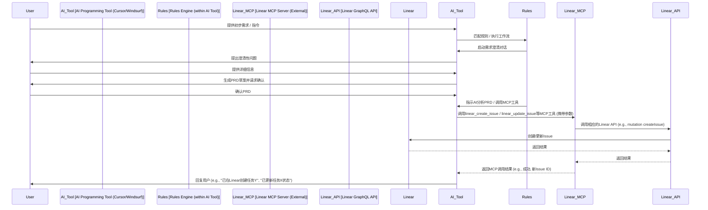

# 项目说明文档：AI-Tasks

## 1. 项目目标与愿景 (Goal & Vision)

**项目名称:** AI-Tasks

**核心目标:** 构建一个以先进的 AI 编程辅助工具（如 Cursor, Windsurf）为核心驱动，结合 Linear 作为权威任务管理后端的新一代 AI 辅助软件开发工作流。

**愿景:** 实现从初步需求到代码交付的全流程 AI 高度赋能，最大化开发效率、自动化程度和流程顺畅度，同时利用 Linear 提供清晰、实时的任务追踪与项目管理视图。

## 2. 解决的核心问题 (Problem Solved)

本项目旨在取代并改进 `claude-task-master` 项目的工作模式，解决其存在的若干痛点：

- **效率瓶颈:** `claude-task-master` 需要自行管理和调用多种外部大语言模型 (LLM) 来执行任务分析和管理，增加了复杂性和潜在延迟。
- **成本与维护:** 管理多个外部 LLM 接口增加了集成成本和维护负担。
- **数据孤岛:** 任务数据存储在本地 `tasks.json`，与主流项目管理工具（如 Linear）脱节。
- **集成模式:** 虽然 `claude-task-master` 提供了 MCP 服务，但其核心是围绕自身任务体系。

**AI-Tasks 通过以下方式解决这些问题:**

- **AI 能力内聚:** 将需求澄清、PRD 解析、任务分解、代码生成等 AI 分析与执行能力，统一由 AI 编程工具（Cursor/Windsurf）的**内置 LLM** 处理。
- **Linear 作为单一事实来源 (Single Source of Truth):** 所有任务的创建、状态更新、依赖关系等均记录在 Linear 中，作为权威数据源。
- **标准化的集成:** 通过 **MCP (Model Context Protocol)** 实现 AI 编程工具与 Linear 之间的交互，委托一个专门的 **Linear MCP 服务** 处理对 Linear API 的调用。

## 3. 核心原则与设计理念 (Core Principles)

- **AI 编程工具中心化:** Cursor/Windsurf 是工作流的核心引擎和主要用户交互界面。
- **Linear 即任务数据库:** Linear 承担所有任务的持久化存储、状态追踪和关系管理。项目本身**不**维护独立的任务数据库（如 `tasks.json`）。
- **MCP 作为桥梁:** AI 编程工具通过调用**外部的 Linear MCP 服务**来间接操作 Linear，实现解耦。
- **规则与 Prompt 驱动:** 工作流程（如需求澄清、PRD 解析、任务更新逻辑）主要通过 AI 编程工具的规则 (Rules/Workflows) 和精心设计的提示 (Prompts) 来定义和执行。
- **交互式需求细化:** 支持通过 AI 对话将初步需求逐步细化，并生成结构化 PRD 进行确认，确保任务质量从源头把控。
- **复用与适配:** 借鉴 `claude-task-master` 的优秀实践，特别是其 PRD 解析思路 (Prompt 设计) 和规则结构，并将其适配到新的架构中。

## 4. 系统架构 (System Architecture)

主要组件及其交互关系：

1.  **AI 编程工具 (例如: Cursor, Windsurf):**
    - 用户主要交互界面（自然语言、代码编辑）。
    - 内置 LLM，负责执行需求澄清、PRD 分析、任务分解、代码生成等智能任务。
    - 执行项目配置的规则 (Rules/Workflows)。
    - 根据规则和用户指令，调用 Linear MCP 服务的工具。
2.  **Linear:**
    - 云端项目管理平台。
    - 存储所有项目任务 (Issues)、子任务 (Sub-Issues)、状态、优先级、依赖关系等。
    - 提供项目进度可视化看板。
3.  **Linear MCP 服务 (外部组件):**
    - 一个独立的、运行中的服务（**本项目不包含其源码，仅配置和调用**）。
    - 接收来自 AI 编程工具的 MCP 请求。
    - 封装了对 **Linear GraphQL API** 的调用逻辑。
    - 暴露一系列 MCP 工具 (Tools)，例如：
      - `linear_create_issue`
      - `linear_update_issue`
      - `linear_get_issue`
      - `linear_create_comment`
      - `linear_add_dependency`
      - ... (根据需要定义的其他操作)
4.  **项目配置 (Project Configuration):**
    - `.cursor/rules/` 或 `.windsurf/`: 存放指导 AI 编程工具行为的规则和工作流文件 (适配自 `claude-task-master` 并符合目标工具格式)。
    - `prd_templates/`: 存储 PRD 模板，用于需求澄清阶段生成结构化 PRD 文档。
    - `.config/linear_settings.json` (示例): 存储项目特定的 Linear 配置，如默认 Team ID、Project ID，供规则读取并传递给 MCP 工具。
    - AI 编程工具本身的 MCP 客户端配置：指向 Linear MCP 服务的地址。

**交互流程示意:**

## 5. 核心工作流示例 (Core Workflow Example)

### 阶段 0: 需求获取、澄清与 PRD 生成

1.  **输入**: 用户在 AI 编程工具中提供简单的需求描述。
2.  **触发**: AI 编程工具识别到需求输入，激活需求澄清规则。
3.  **对话**: AI 扮演业务分析师角色，提出澄清性问题，与用户进行多轮对话收集信息。
4.  **生成**: AI 基于对话内容和预定义 PRD 模板生成结构化 PRD 草案。
5.  **确认**: 用户审核 PRD 并确认，作为下一阶段输入。

### 阶段 1: PRD 分析与 Linear 任务创建

1.  **分析**: AI 编程工具使用内置 LLM 分析确认后的 PRD，提取任务列表。
2.  **创建**: AI 通过 Linear MCP 服务，在 Linear 中创建对应任务(Issues)。
3.  **关联**: AI 分析并建立任务间的依赖关系，设置适当标签和优先级。
4.  **反馈**: MCP 服务将创建结果返回给 AI 编程工具，反馈给用户。

### 阶段 2-4: 任务实施与管理

5.  **开发计划**: 通过 Linear 查看待办任务，根据依赖关系和优先级选择下一个任务。
6.  **实施**: 开发人员实现任务，AI 编程工具提供代码生成和建议。
7.  **状态更新**: 通过 Linear MCP 服务更新任务状态和添加评论。
8.  **完成与验证**: 标记任务完成，关联 Pull Request 和验证结果。

## 6. 与 `claude-task-master` 的关系 (Relation to `claude-task-master`)

- **继承/适配**:
  - **需求分析思路**: 复用其基于 AI 和 Prompt 的需求分析方法论，但增强了交互式需求澄清阶段。
  - **PRD 解析思路**: 复用其基于 AI 和 Prompt 的 PRD 解析方法论。
  - **规则结构与概念**: 借鉴其`.cursor/rules/`中定义的工作流和规则组织方式，并适配为新工具的格式。
  - **任务属性映射**: 参考其`tasks.json`的字段设计，将其映射到 Linear 的字段。
  - **初始化脚本**: 参考`init.js`的逻辑，创建项目结构和配置文件。
- **核心区别**:
  - **AI 调用方**: AI-Tasks 由 AI 编程工具内置 LLM 执行分析；`claude-task-master`由其自身脚本调用外部 LLM。
  - **需求细化**: AI-Tasks 新增了交互式需求澄清和 PRD 生成阶段；`claude-task-master`直接从已有 PRD 开始。
  - **任务存储**: AI-Tasks 使用 Linear 作为数据库；`claude-task-master`使用本地`tasks.json`。
  - **集成方式**: AI-Tasks 通过调用外部 Linear MCP 服务与 Linear 交互；`claude-task-master`通过内部 MCP 服务暴露自身任务管理功能。

## 7. 关键技术与概念 (Key Technologies & Concepts)

- AI Programming Tools (Cursor, Windsurf)
- Large Language Models (LLMs - 内嵌于 AI 工具中)
- Linear Project Management Platform & API
- Model Context Protocol (MCP)
- Prompt Engineering
- PRD Templates & Generation
- Rule Engines (Cursor Rules, Windsurf Workflows/Memories)
- Markdown (for PRD and potentially rule definitions)
- JSON (for configuration and potentially MCP data)

---
